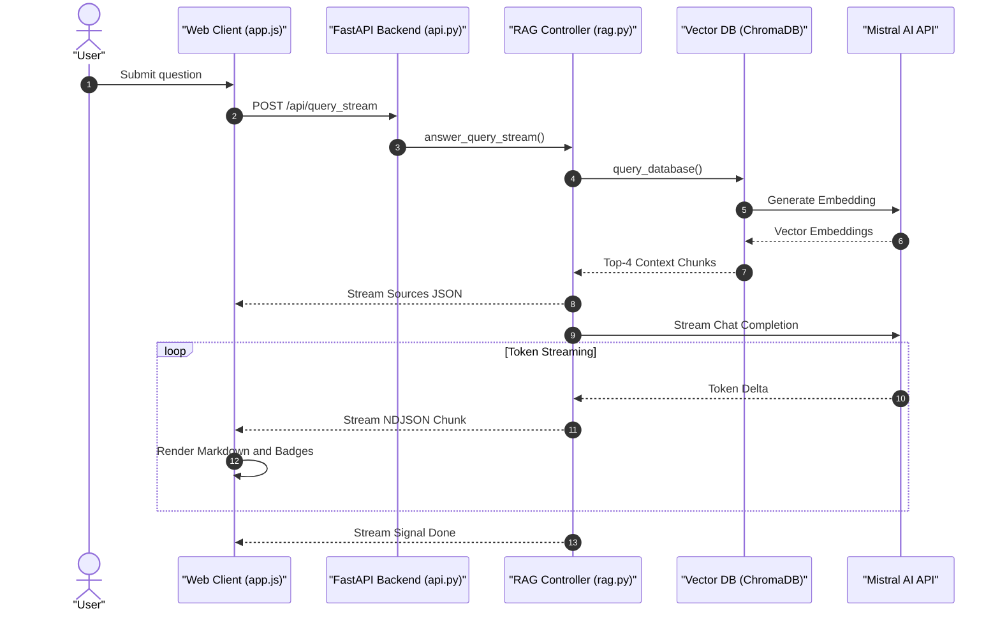
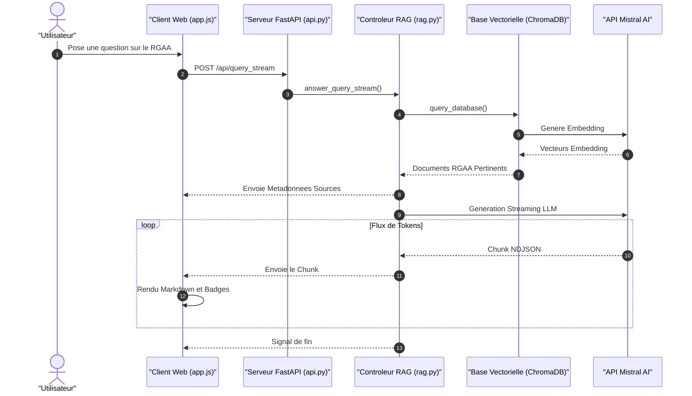

# ♿ RGAA DevCompanion — Copilote d'Accessibilité Numérique / AI Accessibility Copilot

[](https://rgaa-rag.onrender.com)
[](https://www.python.org/)
[](https://fastapi.tiangolo.com/)
[](https://mistral.ai/)
[](https://www.trychroma.com/)
[](https://www.systeme-de-design.gouv.fr/)
[](https://github.com/etalab/licence-ouverte/blob/master/LO.md)

🌐 **Live Website / Site en ligne** : [https://rgaa-rag.onrender.com](https://rgaa-rag.onrender.com)

---

### 🌐 Select Language / Choisir la langue

- 🇬🇧 [English Version](#-english-version)
- 🇫🇷 [Version Française](#-version-française)

---

## 🇬🇧 English Version

> An intelligent Retrieval-Augmented Generation (RAG) assistant for web developers, designed to simplify compliance with the **RGAA 4.1** (*Référentiel Général d'Amélioration de l'Accessibilité*) and **WCAG 2.1** standards.

### 📌 Table of Contents (English)

- [Overview](#-overview)
- [Architecture & End-to-End Flow](#-architecture--end-to-end-flow)
- [Tech Stack](#-tech-stack)
- [Key Features](#-key-features)
- [Project Structure](#-project-structure)
- [Installation & Setup](#-installation--setup)
- [Configuration](#-configuration)
- [Usage & API Endpoints](#-usage--api-endpoints)
- [Accessibility Compliance](#-accessibility-compliance)

---

### 🛠️ Overview

Ensuring digital accessibility under European and French regulations requires deep knowledge of the **RGAA 4.1** framework (13 topics, 106 criteria, and hundreds of technical tests). 

**RGAA DevCompanion** solves this challenge by serving as an AI copilot that:
1. **Performs Semantic Vector Search** across official RGAA 4.1 criteria, tests, and technical glossary definitions.
2. **Generates Grounded Answers** via **Mistral AI** (`mistral-small-latest`), complete with accessible HTML/CSS/JS code examples.
3. **Cites Exact Criteria** (`Critère 1.2`, etc.) with interactive badges linking directly to expandable source accordions.
4. **Delivers Real-Time Streaming** (NDJSON) over an accessible DSFR-compliant web UI.

---

### 📐 Architecture & End-to-End Flow

```mermaid
graph TD
    subgraph DataIngestionEN["Data Ingestion Pipeline"]
        A1["JSON RGAA 4.1 Dataset"] --> B1["Text Chunking and Structuring"]
        B1 --> C1["Mistral Embed API"]
        C1 --> D1["ChromaDB Vector Store"]
    end

    subgraph UserQueryFlowEN["RAG Query and Response Pipeline"]
        E1["User Query"] --> F1["FastAPI Backend"]
        F1 --> G1["Query Vectorization"]
        G1 --> H1["ChromaDB Similarity Search"]
        H1 --> I1["Context Assembler and System Prompt"]
        I1 --> J1["Mistral AI LLM API"]
        J1 --> K1["NDJSON Streaming Response"]
        K1 --> L1["Interactive Web UI"]
    end
```





---

### 💻 Tech Stack

- **Backend**: Python 3.10+, FastAPI, Uvicorn, Pydantic, python-dotenv
- **LLM Engine**: Mistral AI API (`mistral-small-latest`) via OpenAI Python SDK compatibility layer (`https://api.mistral.ai/v1`)
- **Embeddings**: Mistral Embed (`mistral-embed`) with `SentenceTransformers` (`paraphrase-multilingual-mpnet-base-v2`) fallback
- **Vector Storage**: ChromaDB (Persistent local vector database)
- **Frontend**: DSFR v1.12.0, Vanilla JS, Marked.js, FontAwesome 6
- **Hosting**: Render ([https://rgaa-rag.onrender.com](https://rgaa-rag.onrender.com))

---

### ✨ Key Features

- **⚡ Real-Time Streaming Responses**: NDJSON streaming for instant perception of response generation.
- **🏷️ Interactive RGAA Criteria Badges**: Automatic regex detection of `Critère X.Y` in answers, turning references into clickable badges that jump directly to source documents.
- **📚 Expandable Source Accordions**: Transparent RGAA 4.1 citations showing exact criterion descriptions, WCAG mappings, and glossary definitions used to generate the answer.
- **♿ Inclusive A11y Controls**:
  - **OpenDyslexic Mode**: Toggle dedicated font optimized for dyslexic developers.
  - **Font Resizer**: Dynamic text scaling (A+/A-).
  - **High Contrast Themes**: Seamless dark and light modes according to DSFR specifications.
  - **Screen Reader Optimized**: Accessible ARIA live regions (`aria-live="polite"`), explicit focus traps, and full keyboard navigation.

---

### 🚀 Installation & Setup

```bash
# Clone the repository
git clone https://github.com/thomasburgalat/rgaa-rag.git
cd rgaa-rag

# Create and activate virtual environment
python -m venv venv
# Linux/macOS: source venv/bin/activate | Windows: .\venv\Scripts\Activate.ps1

# Install dependencies
pip install -r requirements.txt
```

Create a `.env` file:
```env
MISTRAL_API_KEY=your_mistral_api_key_here
MISTRAL_MODEL=mistral-small-latest
```

Ingest data and launch application:
```bash
python ingest_rgaa.py
python api.py
```

Access at `http://127.0.0.1:8000` or view online at **[https://rgaa-rag.onrender.com](https://rgaa-rag.onrender.com)**.

---

<br/>

---

## 🇫🇷 Version Française

> Un assistant intelligent basé sur l'IA et le RAG (Retrieval-Augmented Generation), conçu pour aider les développeurs web à mettre leurs sites en conformité avec le **RGAA 4.1** et les normes **WCAG 2.1**.

🌐 **Démo en ligne** : [https://rgaa-rag.onrender.com](https://rgaa-rag.onrender.com)

---

### 📌 Table des Matières (Français)

- [Présentation Générale](#-présentation-générale)
- [Architecture & Flux de Données](#-architecture--flux-de-données)
- [Stack Technique](#-stack-technique)
- [Fonctionnalités Clés](#-fonctionnalités-clés)
- [Structure du Projet](#-structure-du-projet)
- [Installation & Démarrage](#-installation--démarrage)
- [Configuration](#-configuration-1)
- [Endpoints API](#-endpoints-api)
- [Accessibilité Numérique (a11y)](#-accessibilité-numérique-a11y)

---

### 🛠️ Présentation Générale

Garantir la conformité d'un site web au **RGAA 4.1** exige de maîtriser 13 thématiques, 106 critères et des centaines de tests d'accessibilité.

**RGAA DevCompanion** résout ce défi en agissant comme un copilote IA qui :
1. **Effectue une Recherche Vectorielle Sémantique** parmi les critères officiels du RGAA 4.1, les tests et le glossaire technique.
2. **Génère des Réponses Précises & Sourcées** via **Mistral AI** (`mistral-small-latest`), accompagnées d'exemples de code HTML/CSS/JS accessibles.
3. **Cite Explicitement les Critères** (`Critère 1.2`, etc.) sous forme de badges interactifs reliés directement aux sources en accordéon.
4. **Diffuse les Réponses en Temps Réel** (NDJSON Streaming) dans une interface conforme au Système de Design de l'État (DSFR).

---

### 📐 Architecture & Flux de Données

```mermaid
graph TD
    subgraph IngestionDonneesFR["Ingestion des Donnees"]
        A2["Donnees JSON RGAA 4.1"] --> B2["Decoupage et Structuration"]
        B2 --> C2["API Mistral Embed"]
        C2 --> D2["Base Vectorielle ChromaDB"]
    end

    subgraph FluxRequeteFR["Traitement de la Question RAG"]
        E2["Question Utilisateur"] --> F2["Backend FastAPI"]
        F2 --> G2["Vectorisation de la Question"]
        G2 --> H2["Recherche ChromaDB"]
        H2 --> I2["Assemblage Contexte et Prompt Systeme"]
        I2 --> J2["API LLM Mistral AI"]
        J2 --> K2["Reponse Streaming NDJSON"]
        K2 --> L2["Interface Web et Badges Interactifs"]
    end
```





---

### 💻 Stack Technique

- **Backend** : Python 3.10+, FastAPI, Uvicorn, Pydantic, python-dotenv
- **Moteur LLM** : API Mistral AI (`mistral-small-latest`) via le client compatible SDK OpenAI (`https://api.mistral.ai/v1`)
- **Embeddings** : API Mistral Embed (`mistral-embed`) avec fallback local `SentenceTransformers` (`paraphrase-multilingual-mpnet-base-v2`)
- **Base Vectorielle** : ChromaDB (stockage vectoriel persistant en local)
- **Frontend** : DSFR v1.12.0 (Système de Design de l'État), JavaScript Vanilla, Marked.js, FontAwesome 6
- **Hébergement** : Render ([https://rgaa-rag.onrender.com](https://rgaa-rag.onrender.com))

---

### ✨ Fonctionnalités Clés

- **⚡ Génération en Streaming Temps Réel** : Réponse fluide diffusée token par token via NDJSON.
- **🏷️ Badges Clicables de Critères RGAA** : Détection automatique des références `Critère X.Y` dans la réponse, transformées en badges interactifs qui ouvrent et mettent en valeur la source correspondante.
- **📚 Sources en Accordéon Détaillées** : Citation transparente des critères, tests WCAG et termes de glossaire utilisés pour construire la réponse.
- **♿ Options d'Accessibilité Avancées** :
  - **Police OpenDyslexic** : Activation d'une typographie adaptée pour les développeurs dyslexiques.
  - **Ajustement de la Taille du Texte** : Zoom dynamique (`A+` / `A-`).
  - **Thèmes Sombre et Clair** : Bascule fluide selon les spécifications officielles du DSFR.
  - **Optimisé Lecteurs d'Écran** : Zones ARIA live (`aria-live="polite"`), gestion du focus et navigation 100% au clavier.

---

### 📁 Structure du Projet

```text
rgaa/
├── .env                  # Clés d'API et variables d'environnement
├── requirements.txt      # Dépendances Python
├── config.py             # Configuration globale de l'application
├── database.py           # Connexion ChromaDB et fonctions d'embedding Mistral
├── ingest_rgaa.py        # Ingestion des critères RGAA dans la base vectorielle
├── llm.py                # Client Mistral AI et prompts système
├── rag.py                # Contrôleur RAG (recherche vectorielle + streaming)
├── api.py                # Serveur FastAPI et endpoints de l'application
├── data/
│   └── criteres.json     # Référentiel officiel des critères, tests et glossaire RGAA 4.1
├── chroma_db/            # Base de données vectorielle locale ChromaDB
└── static/
    ├── index.html        # Vue principale conforme DSFR
    ├── style.css         # Styles sur-mesure et rendu Markdown
    └── app.js            # Logique client (streaming, marked.js, contrôles a11y)
```

---

### 🚀 Installation & Démarrage Rapide

#### 1. Cloner le projet et installer les dépendances

```bash
git clone https://github.com/thomasburgalat/rgaa-rag.git
cd rgaa-rag

# Créer un environnement virtuel
python -m venv venv
# Linux/macOS : source venv/bin/activate
# Windows : .\venv\Scripts\Activate.ps1

# Installer les packages
pip install -r requirements.txt
```

#### 2. Configurer le fichier `.env`

Créer un fichier `.env` à la racine :

```env
MISTRAL_API_KEY=votre_cle_api_mistral
MISTRAL_MODEL=mistral-small-latest
```

#### 3. Lancer l'ingestion & le serveur

```bash
# Ingestion des données RGAA
python ingest_rgaa.py

# Démarrage du serveur local
python api.py
```

Ouvrez **[http://127.0.0.1:8000](http://127.0.0.1:8000)** dans votre navigateur ou testez directement la démo en ligne sur **[https://rgaa-rag.onrender.com](https://rgaa-rag.onrender.com)**.

---

### 📡 Endpoints API

| Méthode | Endpoint | Description | Exemple de corps |
| :--- | :--- | :--- | :--- |
| `POST` | `/api/query` | Requête RAG classique avec réponse JSON directe | `{"question": "...", "n_results": 5}` |
| `POST` | `/api/query_stream` | Requête RAG avec streaming NDJSON en temps réel | `{"question": "...", "n_results": 4}` |
| `POST` | `/api/ingest` | Lance l'ingestion des critères RGAA en tâche de fond | *Aucun* |

---

### 📄 Licence

Ce projet est distribué sous la **Licence Ouverte Etalab 2.0** (`etalab-2.0`). Voir le fichier [Licence Etalab](https://github.com/etalab/licence-ouverte/blob/master/LO.md) pour plus de détails.
